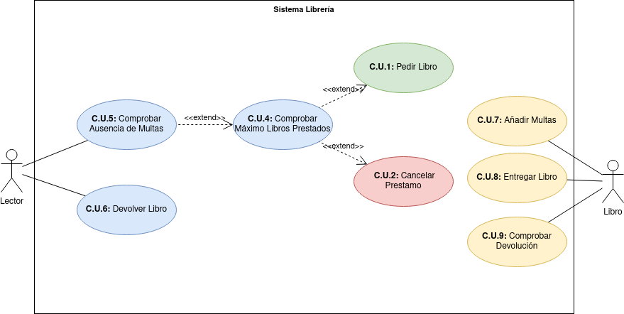

## Descripción

  - Una	 biblioteca	 tiene	 copias	 de	 libros.	 Estos	 últimos se	 caracterizan	 por	 su	 nombre,	 tipo	(ingeniería,	literatura,	informática,	historia	...),	editorial,	año	y	autor.
  - Los	autores	se	caracterizan	por	su	nombre,	nacionalidad	y	fecha	de nacimiento.
  - Cada	 copia	 tiene	 un	identificador,	y	 puede	estar	en	la	 biblioteca,	 prestada, con	 retraso	 o	en	 reparación.
  - Los	lectores	pueden	tener	un	máximo	de	3	libros	en	préstamo.
  - Cada	libro	se	presta	un	máximo	de	30	días,	y	por	cada	día	de	retraso,	se impone	una	“multa” de	dos	días	sin	posibilidad	de	coger	un	nuevo	libro.
  - Realiza	 un	 diagrama	 de	 clases	 y	 añade	 los	 métodos	 necesarios	 para realizar	 el	 préstamo	 y devolución	de	libros.
  Realiza	un	diagrama	de	casos	de	usos.

## Diagrama

## Actores

|  Actor | Lector |
|---|---|
| Descripción  | El usuario que acude a la libreria a pedir o devolver libros  |
| Características  | Cantidad de libros en prestamo, cantidad de multas |
| Relaciones | Pedir Libro, Devolver Libro, Comprobar Máximo Libros Prestados, Comprobar Ausencia de Multas, Cancelar Prestamo |
| Referencias | [Casos de uso](https://github.com/jpexposito/docencia/blob/master/Primero/ETS/DIAGRAMAS/DIAGRAMAS-CLASES/Ejemplos/biblioteca.md) |   
|  Notas |   |
| Autor  | JonayKB|
|Fecha | 03-12-2023 |

|  Actor | Libro |
|---|---|
| Descripción  | Objeto que recibe y comprueba sus atributos  |
| Características  | Identificador, tipo, editorial, año y autor(nombre, nacionalidad, fecha de nacimiento), estado |
| Relaciones | Entregar Libro, Comprobar Devolución, Añadir Multas |
| Referencias | [Casos de uso](https://github.com/jpexposito/docencia/blob/master/Primero/ETS/DIAGRAMAS/DIAGRAMAS-CLASES/Ejemplos/biblioteca.md) |   
|  Notas |   |
| Autor  | JonayKB|
|Fecha | 03-12-2023 |

## Casos de Uso

  |  Caso de Uso    CU | 1  |
  |---|---|
  | Fuentes  | [Casos de uso](https://github.com/jpexposito/docencia/blob/master/Primero/ETS/DIAGRAMAS/DIAGRAMAS-CLASES/Ejemplos/biblioteca.md)  |
  | Actor  |  Lector |
  | Descripción | Pide el libro  |
  | Flujo básico | 1- Pedir el libro |
  | Pre-condiciones |   |  
  | Post-condiciones  |   |  
  |  Requerimientos | Comprobar Máximo Libros Prestados, Comprobar Ausencia de Multas |
  |  Notas |   |
  | Autor  | JonayKB |
  |Fecha | 03-12-2023 |

  |  Caso de Uso    CU | 2  |
  |---|---|
  | Fuentes  | [Casos de uso](https://github.com/jpexposito/docencia/blob/master/Primero/ETS/DIAGRAMAS/DIAGRAMAS-CLASES/Ejemplos/biblioteca.md)  |
  | Actor  |  Lector |
  | Descripción | Cancela el prestamo  |
  | Flujo básico | 1- Cancelar el prestamo |
  | Pre-condiciones |   |  
  | Post-condiciones  |   |  
  |  Requerimientos | Comprobar Máximo Libros Prestados, Comprobar Ausencia de Multas |
  |  Notas |  Si no se cumplen las dos se cancela el prestamo |
  | Autor  | JonayKB |
  |Fecha | 03-12-2023 |

  |  Caso de Uso    CU | 4  |
  |---|---|
  | Fuentes  | [Casos de uso](https://github.com/jpexposito/docencia/blob/master/Primero/ETS/DIAGRAMAS/DIAGRAMAS-CLASES/Ejemplos/biblioteca.md)  |
  | Actor  |  Lector |
  | Descripción | Comprobar Máximo Libros Prestados  |
  | Flujo básico | 1- Comprueba el máximo de libros 2- Si son 3 3- Cancela el prestamo 4- Sino 5-Continua |
  | Pre-condiciones |   |  
  | Post-condiciones  |   |  
  |  Requerimientos | Comprobar Ausencia de Multas |
  |  Notas |  Si no se cumplen las dos se cancela el prestamo |
  | Autor  | JonayKB |
  |Fecha | 03-12-2023 |

  |  Caso de Uso    CU | 5  |
  |---|---|
  | Fuentes  | [Casos de uso](https://github.com/jpexposito/docencia/blob/master/Primero/ETS/DIAGRAMAS/DIAGRAMAS-CLASES/Ejemplos/biblioteca.md)  |
  | Actor  |  Lector |
  | Descripción | Comprobar Ausencia de Multas  |
  | Flujo básico | 1- Comprueba las multas 2- Si tiene 3- Cancela el prestamo 4- Sino 5-Continua |
  | Pre-condiciones |   |  
  | Post-condiciones  |   |  
  |  Requerimientos |  |
  |  Notas |  Si no se cumplen las dos se cancela el prestamo |
  | Autor  | JonayKB |
  |Fecha | 03-12-2023 |

  |  Caso de Uso    CU | 6  |
  |---|---|
  | Fuentes  | [Casos de uso](https://github.com/jpexposito/docencia/blob/master/Primero/ETS/DIAGRAMAS/DIAGRAMAS-CLASES/Ejemplos/biblioteca.md)  |
  | Actor  |  Lector |
  | Descripción | Devolver libro  |
  | Flujo básico | 1- Devuelve el libro |
  | Pre-condiciones |   |  
  | Post-condiciones  |   |  
  |  Requerimientos |  |
  |  Notas |  |
  | Autor  | JonayKB |
  |Fecha | 03-12-2023 |

  |  Caso de Uso    CU | 7  |
  |---|---|
  | Fuentes  | [Casos de uso](https://github.com/jpexposito/docencia/blob/master/Primero/ETS/DIAGRAMAS/DIAGRAMAS-CLASES/Ejemplos/biblioteca.md)  |
  | Actor  |  Libro |
  | Descripción | Añadir Multas  |
  | Flujo básico | 1- Añade las multas |
  | Pre-condiciones |   |  
  | Post-condiciones  |   |  
  |  Requerimientos |  |
  |  Notas |  |
  | Autor  | JonayKB |
  |Fecha | 03-12-2023 |

  |  Caso de Uso    CU | 8  |
  |---|---|
  | Fuentes  | [Casos de uso](https://github.com/jpexposito/docencia/blob/master/Primero/ETS/DIAGRAMAS/DIAGRAMAS-CLASES/Ejemplos/biblioteca.md)  |
  | Actor  |  Libro |
  | Descripción | Entregar libro  |
  | Flujo básico | 1- Presta el libro |
  | Pre-condiciones |   |  
  | Post-condiciones  |   |  
  |  Requerimientos |  |
  |  Notas |  |
  | Autor  | JonayKB |
  |Fecha | 03-12-2023 |

  |  Caso de Uso    CU | 9  |
  |---|---|
  | Fuentes  | [Casos de uso](https://github.com/jpexposito/docencia/blob/master/Primero/ETS/DIAGRAMAS/DIAGRAMAS-CLASES/Ejemplos/biblioteca.md)  |
  | Actor  |  Libro |
  | Descripción | Comprobar Devolución  |
  | Flujo básico | 1- Comprueba que se devuelve el libro |
  | Pre-condiciones |   |  
  | Post-condiciones  |   |  
  |  Requerimientos |  |
  |  Notas |  |
  | Autor  | JonayKB |
  |Fecha | 03-12-2023 |

