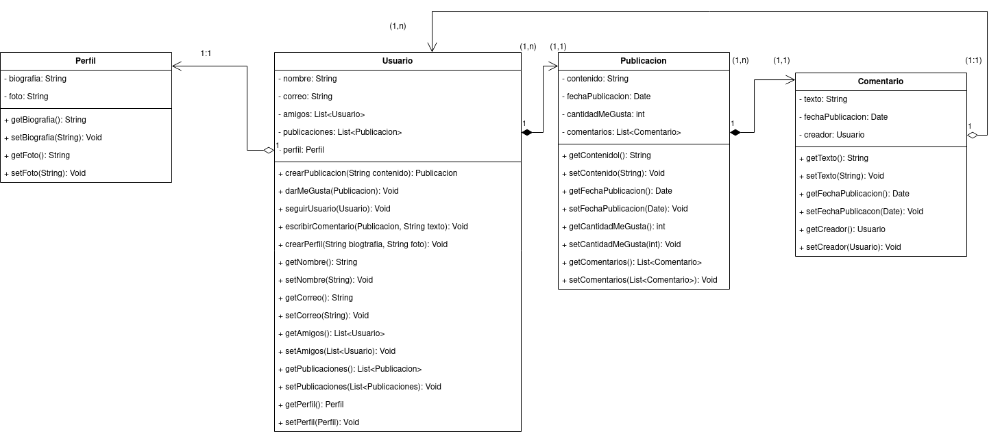

# Red Social:
## Diagrama:
<div align= "justify">

<div align="center">

</div>

## Pseudocódigo
### __Clase Usuario:__
```code
Clase{
    String nombre
    String correo
    List<Usuario> amigos
    List<Publicacion> publicaciones
    Perfil perfil
    ConstructorPorDefecto(){}
    ConstructorCompleto(String nombre, String correo, ArrayList<Usuario> amigos, ArrayList<Publicacion> publicaciones, Perfil perfil){
        nombre
        correo
        amigos
        publicaciones
        perfil
    }

    <<Getters y Setters>>

    crearPublicacion(String contenido){
        Crear una instancia de publicacion y añadirla a la lista
    }
    darMeGusta(Publicacion publicacion){
        publicacion.setCantidadMeGusta(publicacion.getCantidadMeGusta+1)
    }
    seguirUsuario(Usuario usuario){
        Añadir a amigos al usuario y en el usuario añadir a este a amigos
    }
    escribirComentario(Publicacion publicacion, String texto){
        Instancia un nuevo comentario en "publicacion" con el argumento de texto pedido
    }
    crearPerfil(String biografia, String foto){
        crea un nuevo perfil con dichos valores
    }
}
```
### __Clase Perfil:___
```code
Clase{
    String biografia
    String foto
    ConstructorPorDefecto(){}
    ConstructorCompleto(String biografia, String foto){
        biografia
        foto
    }
    
    <<Getters y Setters>>

}
```

### __Clase Publicacion:___
```code
Clase{
    String contenido
    Date fechaPublicacion
    int cantidadMeGusta
    List<Comentario> comentarios
    ConstructorPorDefecto(){}
    ConstructorCompleto(String contenido){
        contenido
        fechaPublicacion = new Date()
        cantidadMeGusta = 0;
        comentarios = new ArrayList<comentario>
    }
    
    <<Getters y Setters>>

}
```

### __Clase Comentario:___
```code
Clase{
    String texto
    Date fechaPublicacion
    Usuario creador
    ConstructorPorDefecto(){}
    ConstructorCompleto(String texto){
        texto
        fechaPublicacion = new Date()
        creador = Usuario que ejecuto la funcion
    }
    
    <<Getters y Setters>>

}
```


</div>