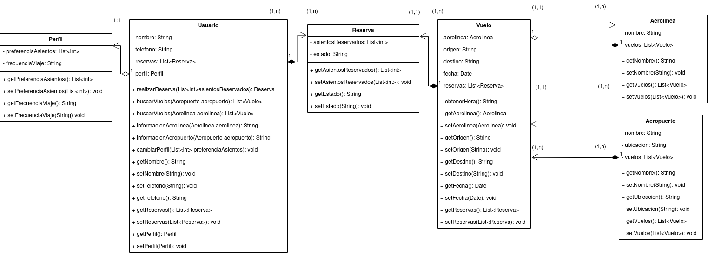

# Agencia de Reserva de Vuelos:
## Diagrama:
<div align= "justify">

<div align="center">

</div>

## Pseudocódigo:
### __Clase Perfil__:
```code
Clase{
    List<int> preferenciaAsientos
    String frecuenciaViaje

    ConstructorPorDefecto(){}
    CosntructorCompleto(String preferenciaAsientos){
        preferenciaAsientos
        frecuenciaViaje = "";
    }
    <<Getters y Setters>>
}
```
### __Clase Usuario__:
```code
Clase{
    String nombre
    String telefono
    List<Reserva> reservas
    Perfil perfil
    ConstructorPorDefecto(){}
    CosntructorCompleto(String nombre, String telefono){
        nombre
        telefono
        reservas = null
        perfil = new Perfil()
    }
    <<Getters y Setters>>

    realizarReserva(List<int> asientosReservados){
        crear istancia con los asientos reservados dichos
    }
    buscarVuelos(Aeropuerto aeropuerto){
        enseña los vuelos de un aeropuerto
    }
    buscarVuelos(Aerolinea aerolinea){
        enseña los vuelos de una aerolinea
    }
    informacionAerolinea(Aerolinea aerolinea){
        enseña la informacion de la aerolinea (en un string todo)
    }
    informacionAerolinea(Aeropuerto aeropuerto){
        enseña la informacion del aeropuerto (en un string todo)
    }
    cambiarPerfil(List<int> preferenciaAsientos){
        cambia la preferenciaAsientos con la nueva escrita en el perfil ya creado
    }

}
```
### __Clase Reserva__:
```code
Clase{
    List<int> asientosReservados
    String estado

    ConstructorPorDefecto(){}
    CosntructorCompleto(List<int> asientosReservados, String estado){
        asientosReservados
        estado
    }
    <<Getters y Setters>>
}
```
### __Clase Vuelo__:
```code
Clase{
    Aerolinea aerolinea
    String origen
    String destino
    String fecha
    List<Reserva> reservas
    ConstructorPorDefecto(){}
    CosntructorCompleto(Aerolinea aerolinea, String origen, String destino, String fecha ){
        aerolinea
        origen
        destino
        fecha
        reservas
    }
    <<Getters y Setters>>

    obtenerHora(){
        Con la fecha obtiene la hora de salida (un format)
    }
}
```

### __Clase Aerolinea__:
```code
Clase{
    String nombre
    List<Vuelo> vuelos
    ConstructorPorDefecto(){}
    CosntructorCompleto(String nombre, List<Vuelo> vuelos ){
        nombre
        vuelos
    }
    <<Getters y Setters>>
}
```

### __Clase Aeropuerto__:
```code
Clase{
    String nombre
    String ubicacion
    List<Vuelo> vuelos
    ConstructorPorDefecto(){}
    CosntructorCompleto(String nombre, List<Vuelo> vuelos, String ubicacion){
        nombre
        vuelos
        ubicacion
    }
    <<Getters y Setters>>
}
```